# Integrating SAP's IDOC Interface into AWS API Gateway and AWS Lambda

There's a saying that goes "You can't teach an old dog new tricks", and in the world of Enterprise Applicaiton Integrations, the lowly IDOC is certainly an Old Dog.  For decades, SAP's Intermediate Document or IDOC has been a mainstay of messaging integrations patterns.  It's durable, simple, widely supported and proven.  The IDOC processing framework on SAP Netweaver platforms is some of the oldest and most mature code in the entire application.

What I will show you here is how to connect SAP's IDOC interface with various AWS services to perhaps get some new tricks out of the "Old Dog".

I like this integration for a few reasons:

1. Not many companies can just ditch their existing SAP investment to rush to the latest and greatest thing.  This integration allows an SAP system to access the vast services of AWS without major customization.
2. Maybe you have a shortage of ABAP developers, but have plenty of Node.js developers.  You could use this integration to make use of other skill sets for business process automation.
3. Using this process, you could potentially rid your SAP system of some of those little pesky proprietary add-ins and bolt-on solutions that you've collected over the years where the original "guy in a garage" vendor has since went under or the company was bought up several times over and left for dead.
4. No additional SAP adpaters or third-party products required.

**As an aside:  In my research for this solution, I found plenty of people who deeply understood SAP platforms and there were tons of people who knew the AWS world, but it was extremely frustrating that noone seemed to be "bilingual" in both worlds.  This is the sole mission of the AWS Practice at [Applexus](http://www.applexus.com)--to grow a community that can maximize the value at the intersection of the SAP world and the AWS world!**

This documentation is aimed at people who are familiar with both SAP and AWS, and I am leaving out some of the very detailed steps as you can find those elsewhere.  For example, I'm not going to show you how to configure outbound IDOCs for master data distribution.  But, if you know how to do that already, the screens and descriptions will make sense.

## Objectives
- Use standard SAP IDOC functionality using config only--no ABAP code, user exits, BADI's, smoke and mirrors, etc.
- Has to be serverless on the AWS side!
- Has to scale and be highly available

## The Design
Traditionally, you use middleware (SAP PI, WebMethods, BizTalk, etc.) to integrate with an ERP system to provide a layer of abstraction.  That is a smart thing to do but sometimes, middleware is overkill for the scenario, or maybe too costly of an investment.  Maybe you don't have the skillset readily available, or maybe you need an integration *this afternoon*.

I want to demonstrate a method with which you can send messages, IDOCs in this case, to the AWS platform without the need of middleware.  You loose some of the flexiblity and ease of use without middleware, but you can do everything you might need.  This design uses AWS API Gateway as an entry point and serves as a layer of abstraction in itself--allowing for minor message mapping and reshaping.  We also employ Lambda to catch the IDOC as it comes in.  Once it is in Lambda, you can do just about anything. 

For this scenario, we are just going to be converting the message to JSON and dropping it in an S3 bucket. This scenario can have some business value--you can point AWS EMR or QuickSight at the JSON files on S3 to do some reporting or data mining aginst the raw data. Add in some lifecycle rules in S3 and you can transition off to Glacier as a sort of minimalist IDOC archive.


I'm using API Gateway as opposed to directly integrating into specific AWS REST API's because of my first Objective above--use only standard config in the SAP system.  Using standard config and no customization, we don't have any control over the output of the message from SAP.  It comes as it comes, in XML format without the option to add any header params or adjust the body.  Since most of the AWS REST API's require specific form values or header contents, this makes them unavailable to us.  Instead, we can use the API Gateway to take in the natural XML form and shape it how we want.  The API Gateway can also serve as a proxy to virtually every other AWS service.

As docuemnted here, this isn't nesesarily a production-quality configuration.  We are using SSL connections, but I've omited much of the IAM setup, error handling and lock-down that we would do in a more produtionized scenario, but those parts are pretty well documented already.   I wanted to focus on the specific parts that I hadn't seen documented elsewhere to enable this solution.

There are a few variations and extentions that I plan on doing, but will publish those later--including an acknowledgement message back to SAP upon processing of the IDOC and maybe a few more endpoints like Redshift, SES or SQS.  Also, some sort of more user-friendly mapping framework would probably be interesting--SAP's IDOC field names are cryptic and require someone with SAP technical knowledge to make sense of them.

## The Steps

1. Create the Lamdba routine to process IDOC
2. Configure an AWS API Gateway as an endpoint for the IDOC
3. Setup SSL trust for AWS API Gateway
4. Configure outbound SAP RFC destination 
5. Configure outbound IDOC for RFC destination
6. Tying it all together
7. Extra Credit:  Implement a response of ALEAUD IDOC back into SAP

## 1. Create the Lamdba routine to process IDOC
The Lambda code is quite simple and in the repo.  I use an XML to JSON parser and a UUID module to generate unique names.   In a way, this is kind of like Kinesis Firehose functionality.  You could also use Kinesis Firehose as an alternative from the API Gateway, then trigger subsequent processes from there.  The options are limitless.

Because we're using some extra modules, we zip it up and upload to Lambda.  (Plenty of tutorials out there on creating packages to deploy to Lambda)

```javascript
'use strict';

var AWS = require('aws-sdk');
var s3 = new AWS.S3();
var xml2js = require('xml2js');
var uuid = require('node-uuid');

var parseString = new xml2js.Parser({ explicitArray: false }).parseString;

exports.handler = function (event, context, callback) {

    var xmlString = new Buffer(event.body, 'base64').toString();
    parseString(xmlString, function (err, resultParse) {
        var s3Params = {
            Bucket: event.bucket,
            Key: event.sid + '/' + uuid.v1() + '.json',
            Body: JSON.stringify(resultParse)
        };
        s3.putObject(s3Params, function (err, resultS3) {
            callback(err, resultS3);
        });
    });
};
```

## 2. Configure an AWS API Gateway as an endpoint for the IDOC

In my first experiments, I tried to spool IDOCs straight to AWS SQS.  This worked ok, but I ran into a limitation.  I found in testing that SAP will connect to an HTTP endpoint and spool a whole batch of IDOCs rather than sending the messages one by one.

This is actually a good design in that I really wouldn't want to create and close a connection for each and every message...rather I'd like to batch those messages kind of like a pooled connection.  And this exactly what the default behavior is of SAP's HTTP-XML RFC destination.

But this creates a problem in that AWS SQS only supports a maximum message size of 256K.  I was reaching that maximum after only a couple MATMAS05 IDOCs and SQS was truncating the rest of the XML stream.  Additionally, because I want to use the standard HTTP XML stream format out of SAP as-is, I don't have much flexibility in configuring headers, content-type or inserting query string params.  What we need is a layer of abstraction where we can map that default message to pretty much anything that we'd need to make any AWS API call.  AWS API Gateway can do that!  It can proxy for just about every AWS service as well as being able to hand off to AWS Lambda for unlimited possiblities.

*If you find yourself in a situation where you don't have control over the format of the inbound message, then an API Gateway gives you some flexibility.*

However, because API Gateway uses CloudFront as its backend, this does introduce a really sneaky problem into the mix, but we talk about that in step 3.

I'm going to create a path parameter for the System ID or SID (its an SAP thing...).  This way, I can adjust my path in each SAP system so I can carry that uniqueness on to my backend processes.  This is important in cases where we have a DEV, QA and PRD systems...we would not want those messages to get intermingled on accident.

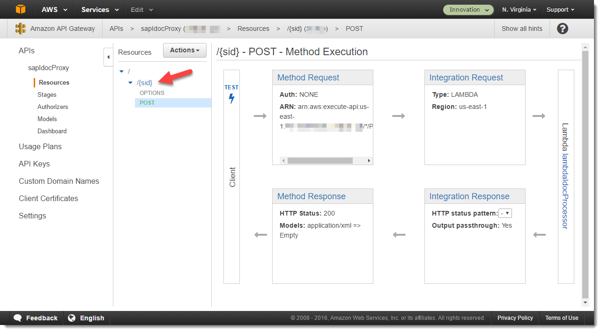

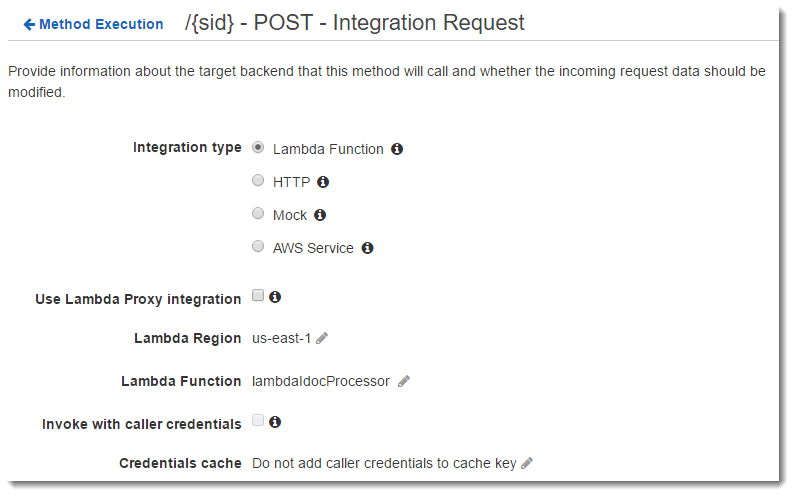

Notice here that I have two Content-Types defined, but they both contain the same mapping.  SAP's XML-HTTP connector uses straight `text/xml` as a content type and because we don't want to do customizations, we just leave it.  Every other testing tool out there, including the API Gateway testing tool wants to use `application/json` so I've created that content type as well.  If the content type doesn't match any of these, we get get a message about unsupported content type...which is what we want per the `Request Body Passthough` setting.

The format is JSON that we send to the Lambda function and ends up in the `event` parameter.  We do a Base64 encode so we don't have to worry about escape characters in the XML body that we received from SAP.

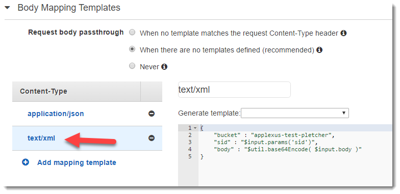

## 3. Setup SSL trust for AWS API Gateway

This is the most complex step and where I found the _least_ amount of documentation on the Interwebs.  Like I mentioned before, noone seemed to know both sides of the equation enough to contribute.  I'll be detailed here.

Out of the box, SAP comes with a few SSL certificates which allow the server to connect to a limited collection of hosts via HTTPS.  As luck would have it, the SSL certificates that SAP ships with don't include those used by the AWS API endpoints.  So, we have to create a SSL Trust and import those certs.

We want to use API Gateway for reasons mentioned above.  I tried and tried to get it to work, but kept getting back cryptic messages when I would test the connection (Step 4).  I could connect to other AWS API destinations just fine, but the API Gateway just didn't want to work.  I turned on all sorts of ICM logging and scrutinized those logs for any clue.  I googled relentlessly, searched both SAP Community Network (SCN) forums and AWS Forums--no luck.

The answer that seemed to always crop up was that I needed to register my own SSL cert from a provider (as API Gateway does not work with self-signed certs nor does it work the AWS Certificate Manager as of this writing).  I was almost ready to admit defeat and drop a few hundred bucks on a wildcard cert when I remembered something...

API Gateway is different from most other AWS API endpoints in that it uses CloudFront as a backend.  I also recalled the two options we have for SSL client support on CloudFront--use SNI or drop $600/month for a dedicated IP at each edge location.  I wondered if SAP supported SNI.  Well, guess what...by default _it does not_....but it can--mostly.

Starting with SAP Netweaver Kernel 7.41+, there is a kernel patch to enable a parameter, `icm/HTTPS/client_sni_enable`, which controls whether SAP (acting as an SSL client) supports SNI.  _By default, it is set to FALSE._  We need to enable this parameter and I bet we could then connect with API Gateway without dropping a few hundred on a custom SSL cert.  See OSS note 2124480 (SMP Login Required).  You can set this parameter in tcode `SCICM` but it will revert after a server restart.  You'll need your BASIS people to save it in the system params in `RZ10` to make it stick.

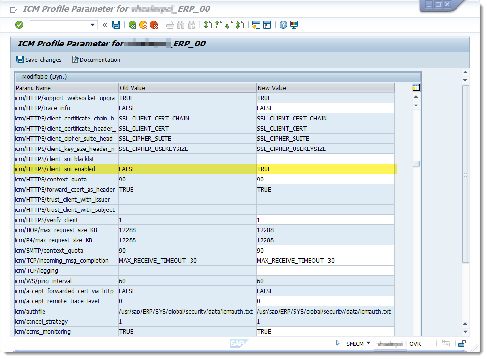

If you only have Kernel 7.2X or earlier, according to OSS note 510007 section 8.a, you are _S-O-L_ if you have to use SNI.  But that doesn't mean you're stuck in this integration.  You can purchase an SSL cert from one of the many issuers and load it up both on the API Gateway and on your SAP system.  Or, you can proxy your request through something that does support SNI.  One easly way could be to create a little Node.js server that's been configured to use a self-signed cert that you load into your SAP system, and it simply takes the HTTPS stream and in turn shoves it into API Gateway or any other AWS service directly via AWS SDK.  You could run this little proxy as a Docker container on the EC2 Container service or maybe on Elastic Beanstalk--but this breaks our "serverless" objective.

We start at tcode `STRUST` and create an SSL Client Identity.

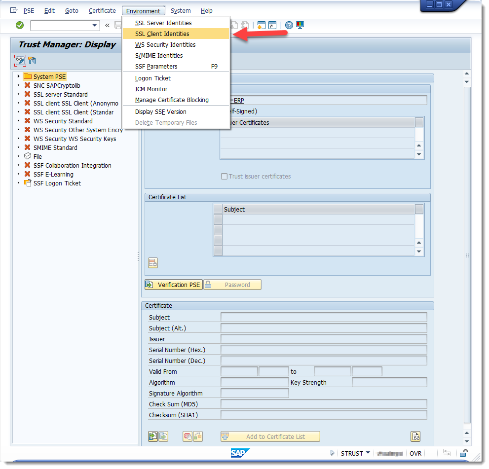

With our Client Identity on the tree, we now create a new PSE.  I just used the default settings.

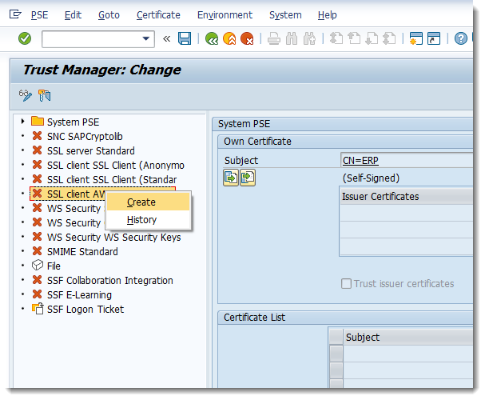

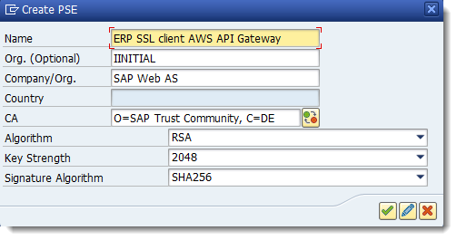

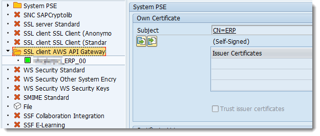

Now, since SAP doesn't naturally have the cert from AWS API Gateway, we have to extract that cert and upload it into our PSE.  We just enter our API URL and it will give us an error message, but that's ok because all we need is the cert.

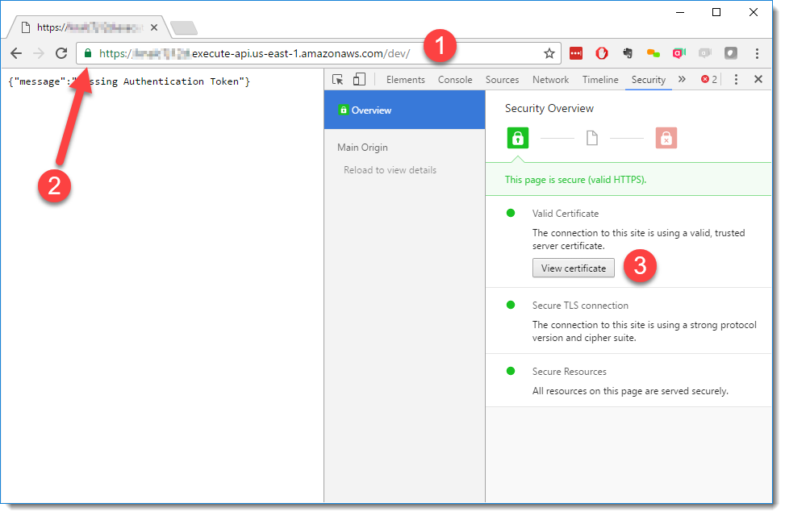

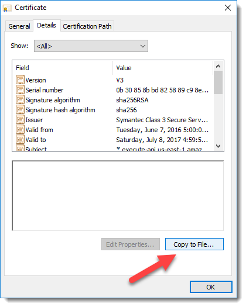

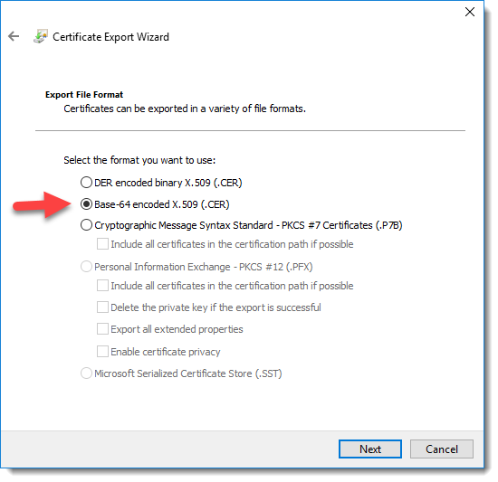

Now we upload the extracted cert into the PSE.

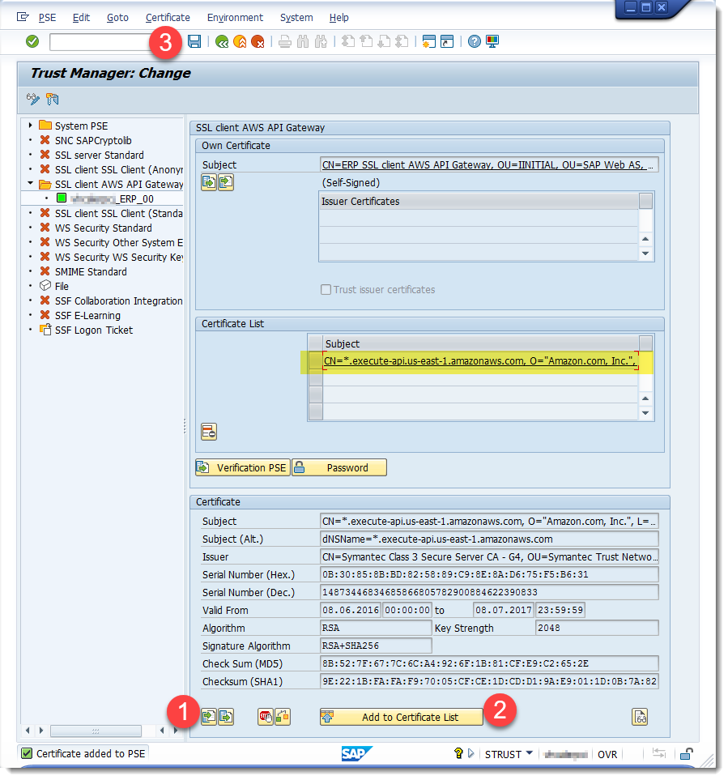

## 4. Configure outbound SAP RFC destination
From here on out on the SAP side, its pretty standard RFC Destination and IDOC outbound config.  I will not include every single step as there are plenty of documents out there which detail the setup of outbound IDOCs.

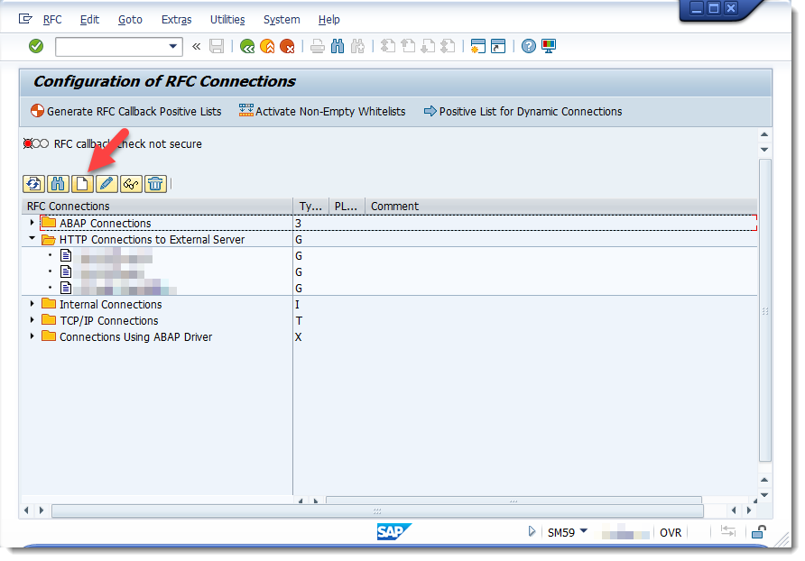

Be sure to use port 443 for HTTPS.  We also include our SID in the URL path.

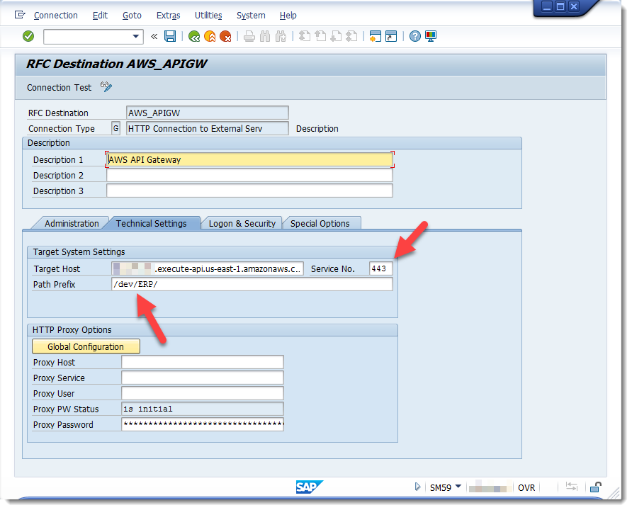

On the `Logon & Security` tab, we set SSL as active and select the proper client certificate repo.

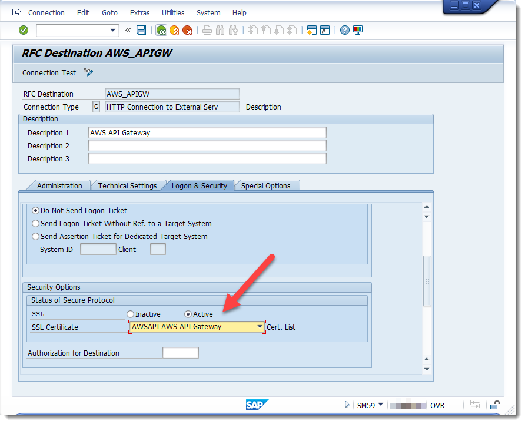

If you now test the RFC, you should get something like this...same message we get in the browser.

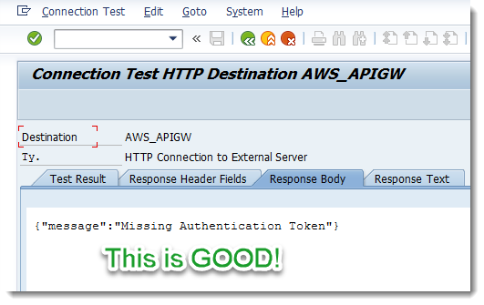

If there's something wrong or missing from your SSL config, you'll get something like this.   If you didn't configure SNI, then you get something that looks much more scary.

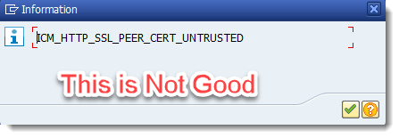

## 5. Configure outbound IDOC for RFC destination
Again, this is standard SAP integration configuration.  As we're using the standard processes in SAP, all the same tools work like WE19, BD64, SALE, Change Pointers, etc.  You can also easliy create your own custom IDOC and fill it with any data you want...sending it out the same Logical System.  

For example, maybe you want to text a customer when their sales order ships out of SAP ECC.  It would be quite simple to enable SMS notifications for certain processes just by creating a minimal IDOC with the receipient's mobile number and message.  Just configure output determination on the SAP ECC side to trigger the SMS IDOC upon Ship Confirm.  Then you could use AWS SNS or AWS SES to send that message via email or SMS.  No need for some specific extra service provider or heavy integration.  

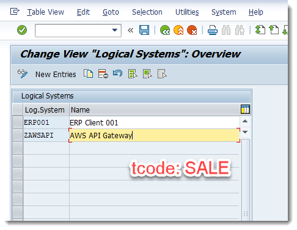

Create a port in `WE21` under the XML-HTTP branch.  Just leave the defaults for Content Type and SOAP protocol.  If you want to play around with SOAP, please know that the XML-HTTP connector wants a certain response back from the SOAP call or else it will fail and leave the IDOC in an error status.  With SOAP unchecked, its more "fire and forget".


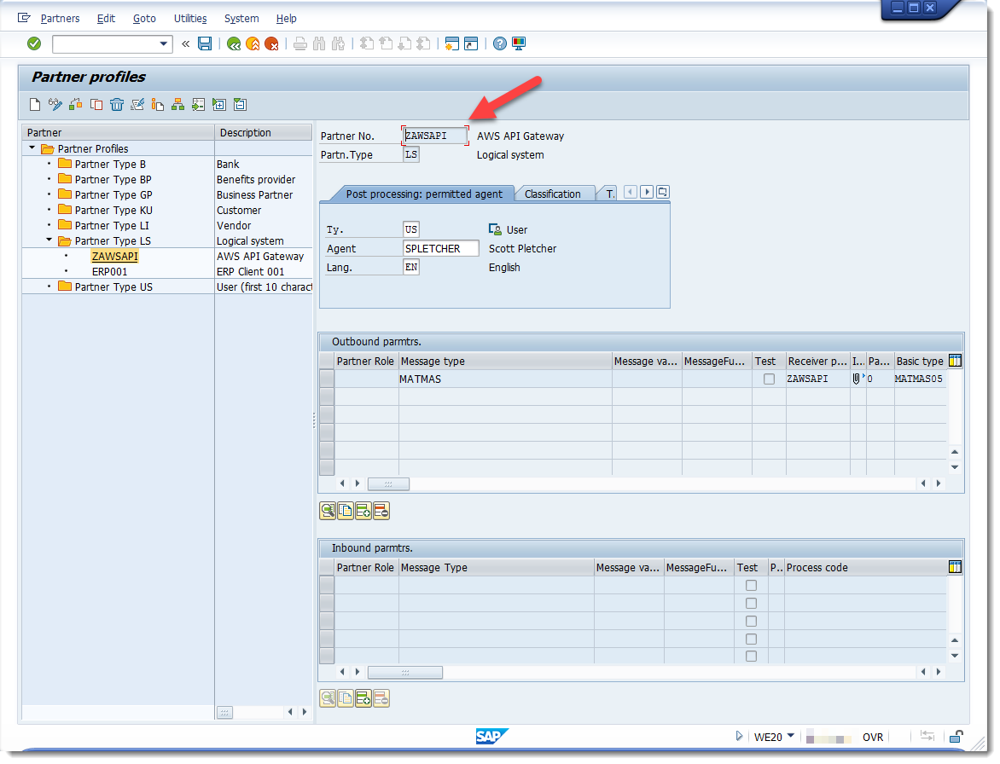

Standard stuff here.  In a high-volume environment, I always recommend using the `Collect IDOC` option and then processing via `RESOUT00` with parallel processing.  Don't worry, API Gateway and Lambda can handle it!

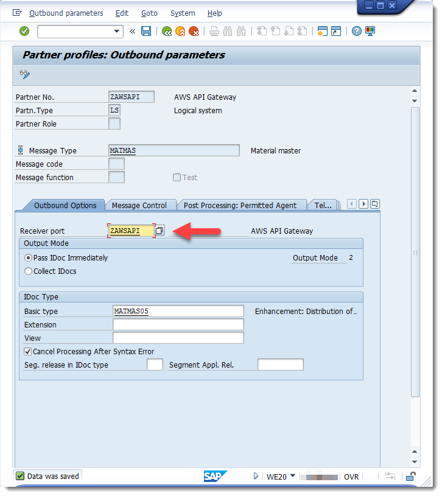

## 6. Tying it all together
And here we are.  Using WE19, I sent some messages out of SAP, and in about 2 seconds later, they show up in our S3 bucket as JSON files.

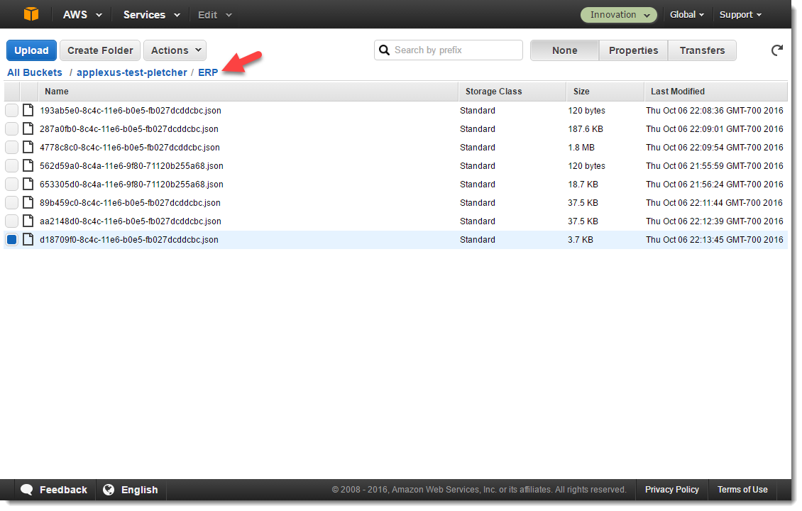

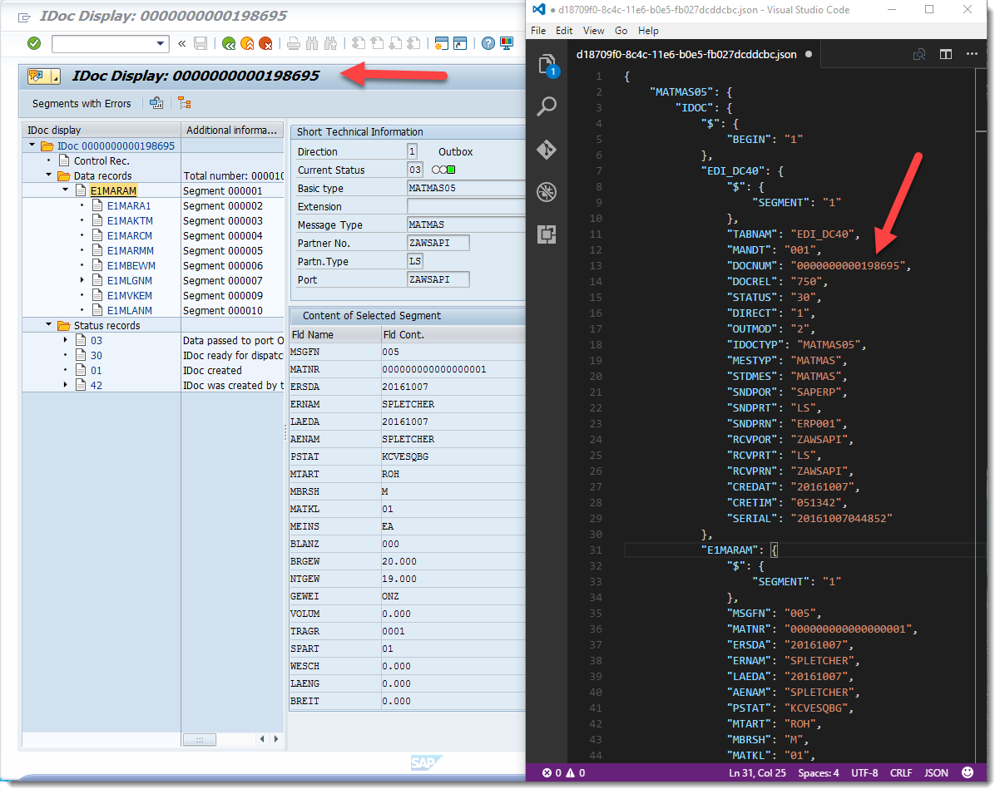

I have a few more scenarios in mind that I'll publish later.   If you'd like to try some POC's or an integration between SAP and AWS, please reach out and I'd be happy to help.  This is what we do for a living...we mine the intersection of SAP and AWS for valuable new capabilities!

Have fun!

## 7. Extra credit: Send ALEAUD IDOC back into SAP

_In Process_
